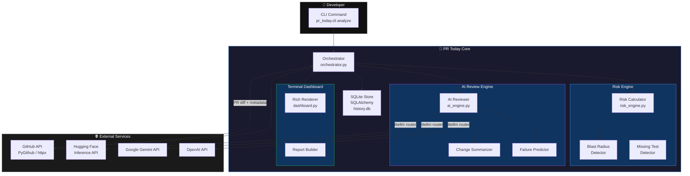
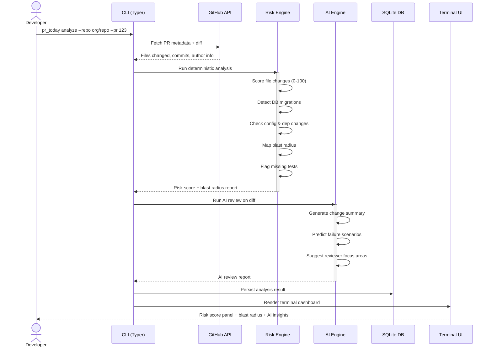
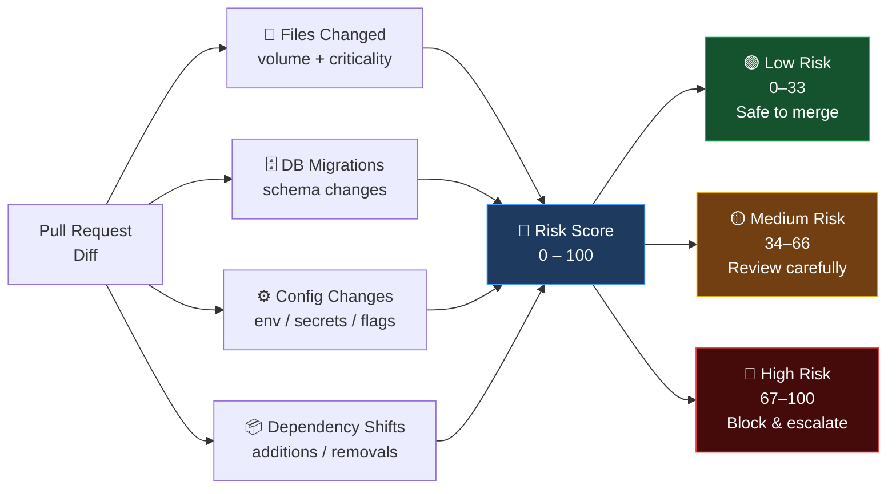
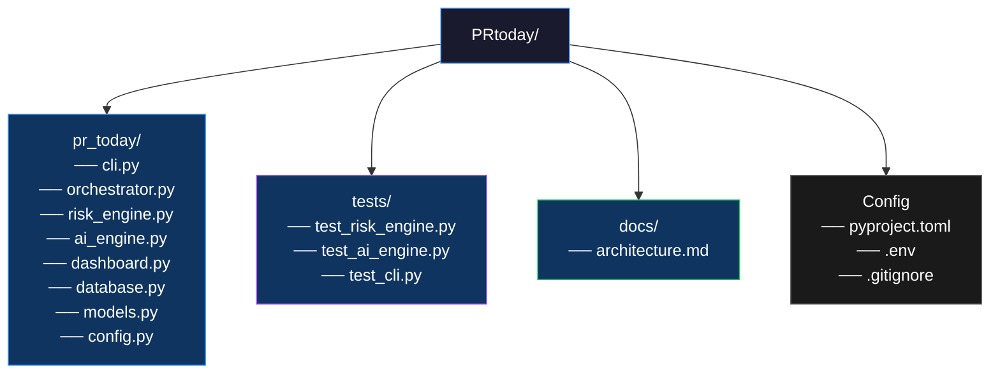
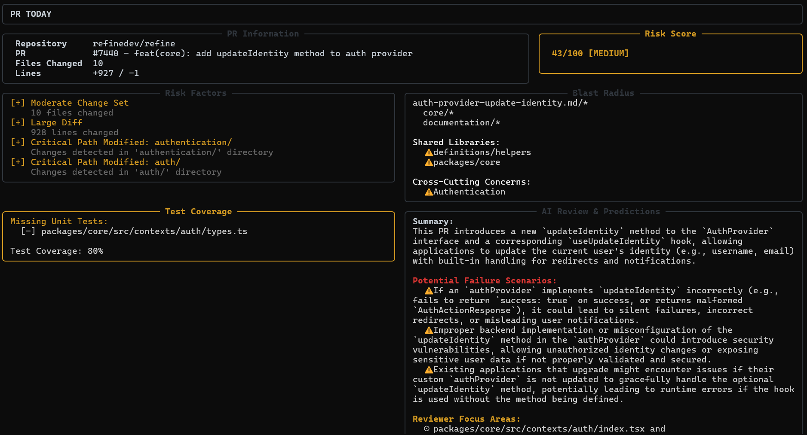
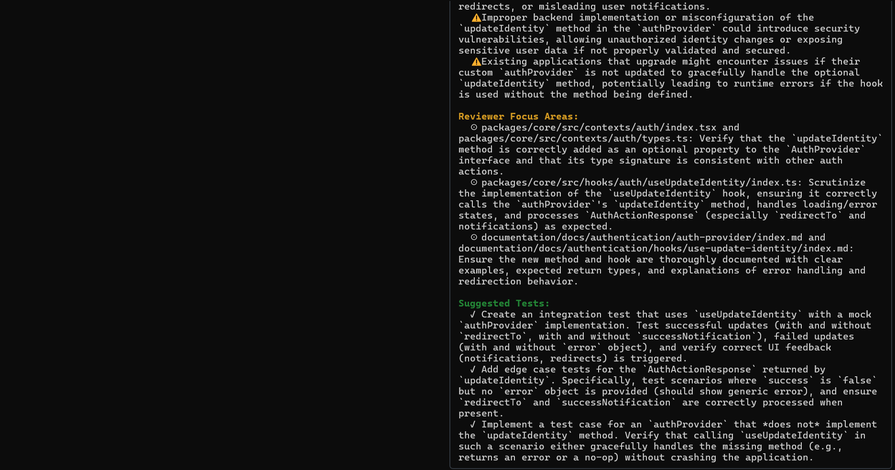
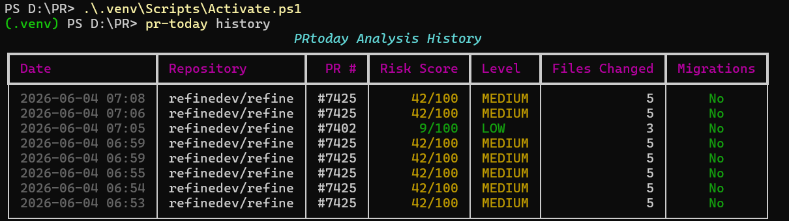

# PR TODAY

> Predict production risk before merge.

PR Today is a terminal-first, developer-centric CLI tool that automatically analyzes Pull Requests and predicts production risk before merge. It acts as an advanced, AI-assisted review engine that gives you a deterministic risk score and blast radius report natively in your terminal.

---

## Features

- **Risk Engine:** Deterministically calculates a risk score (0-100) based on files changed, database migrations, configuration updates, and dependency shifts.
- **Blast Radius Detection:** Determines which modules, services, and shared libraries are impacted by the PR.
- **Missing Test Detection:** Analyzes the diff against existing test coverage to flag missing unit or integration tests.
- **AI Review Engine:** Uses Qwen/DeepSeek (via Hugging Face) to generate an intelligent change summary, predict potential failure scenarios, and suggest reviewer focus areas.
- **Terminal Dashboard:** A gorgeous, dense, and fast UI built with `Rich` that feels like an engineering tool (inspired by k9s, LazyGit, and htop).
- **Analysis History:** Tracks and stores previous PR analyses in a local SQLite database for historical auditing.

---

## Architecture

PR Today is built as a pure Python CLI application with three core subsystems: the **Risk Engine**, **AI Review Engine**, and **Terminal Dashboard** — all orchestrated through a Typer-based CLI.



### Tech Stack

| Layer | Technology |
|---|---|
| Language | Python 3.10+ |
| CLI Framework | Typer |
| Terminal UI | Rich |
| GitHub Integration | PyGithub / httpx |
| Database | Local SQLite via SQLAlchemy |
| AI Engine | Hugging Face Inference API / litellm |

---

## PR Analysis Flow

The end-to-end flow when you run `pr_today analyze`:



---

## Risk Score Breakdown

The deterministic risk score is calculated across four weighted dimensions:



---

## Module Structure



---

## Installation

You will need Python 3.10+ installed.

```bash
# Clone the repository
git clone https://github.com/your-org/pr-today.git
cd pr-today

# Create and activate virtual environment
python -m venv .venv
# On Windows (PowerShell/CMD)
.venv\Scripts\activate
# On macOS/Linux
source .venv/bin/activate

# Install dependencies
pip install -r requirements.txt

# Verify installation
python -m pr_today.cli --help
```

---

## Environment Variables

Create a `.env` file in the root directory:

```env
GITHUB_PAT=your_github_personal_access_token
LOG_LEVEL=INFO

# Choose and configure your AI Provider:

# Option A: Hugging Face (Default)
HF_TOKEN=your_hugging_face_api_token
AI_MODEL=huggingface/Qwen/Qwen2.5-Coder-32B-Instruct

# Option B: Google Gemini
GEMINI_API_KEY=your_gemini_api_key
AI_MODEL=gemini/gemini-2.5-flash

# Option C: OpenAI
OPENAI_API_KEY=your_openai_api_key
AI_MODEL=openai/gpt-4o-mini
```

---

## Usage

```bash
# Analyze a specific PR
python -m pr_today.cli analyze --repo org/repo-name --pr 123

# View analysis history
python -m pr_today.cli history

# Authenticate / Setup
python -m pr_today.cli auth
```

---

## Running Tests

We use `pytest` for end-to-end and unit testing.

```bash
# Run all tests
pytest

# Run tests with coverage
pytest --cov=pr_today
```

---

## Output

Here is an example of the terminal dashboard rendered when analyzing a PR:




Here is an example of the analysis history table:



## Contributing

Please read [CONTRIBUTING.md](CONTRIBUTING.md) for details on our code of conduct and the process for submitting pull requests.

## License

This project is licensed under the MIT License - see the [LICENSE](LICENSE) file for details.