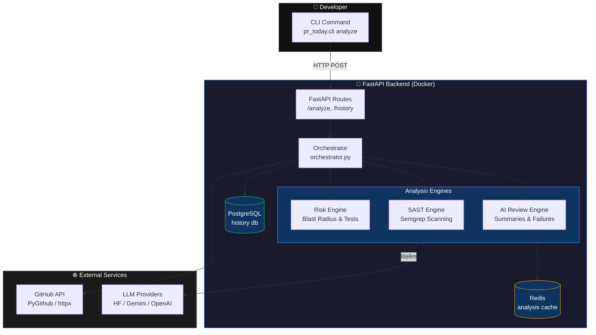
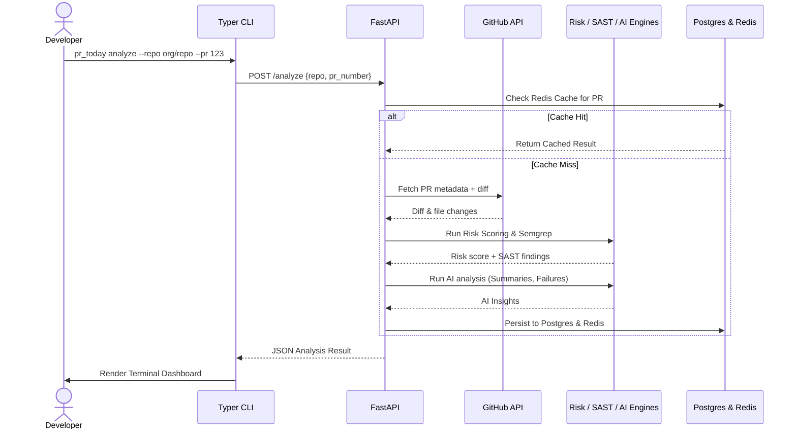
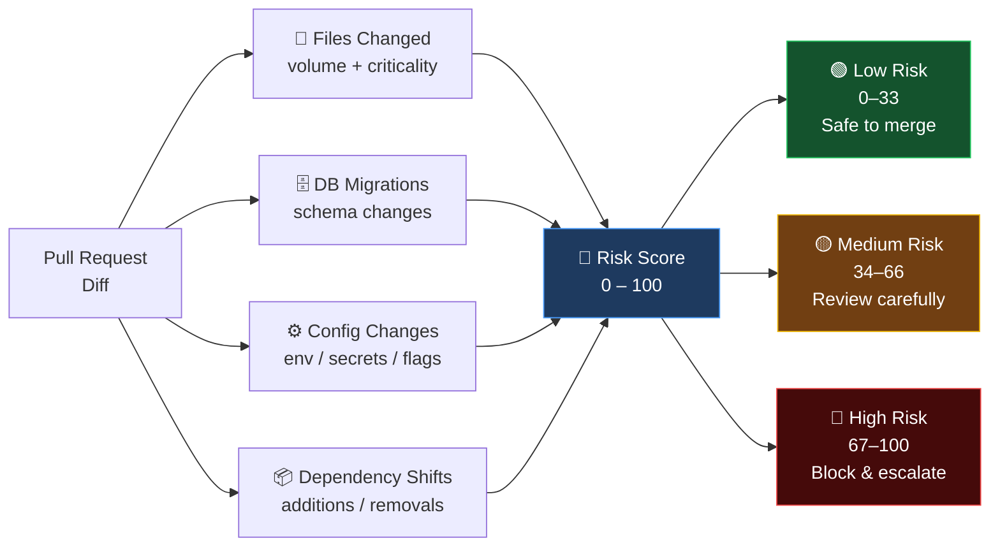
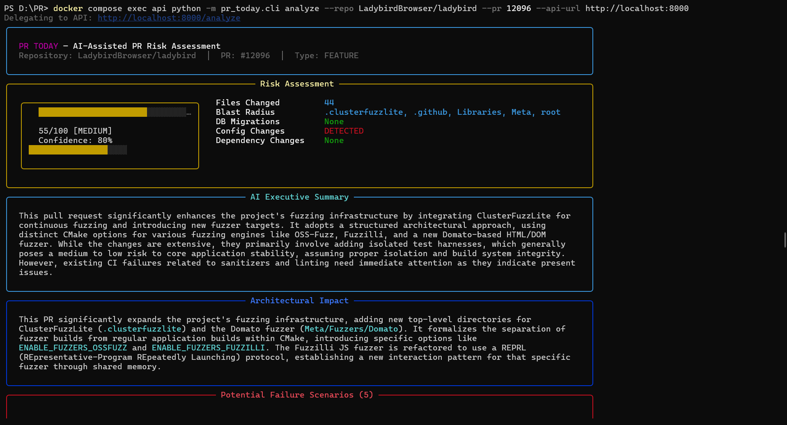
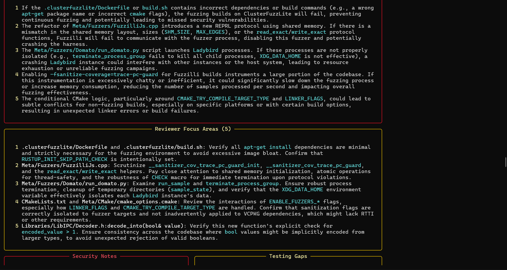
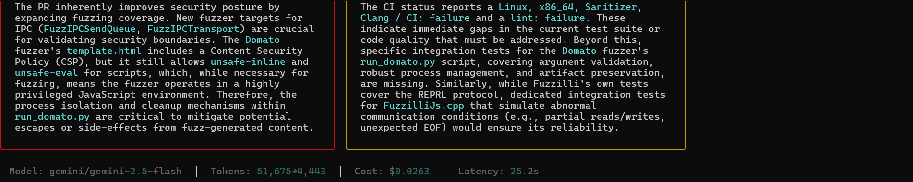

# PR TODAY

> Predict production risk before merge.

PR Today is an advanced, AI-assisted PR review engine. It provides a deterministic risk score, blast radius report, SAST security checks, and AI-driven insights—all available via a scalable **FastAPI backend** and a gorgeous **terminal-first CLI dashboard**. 

Designed to catch potential regressions, security vulnerabilities, and architectural bottlenecks before they ever hit your main branch.

---

## 🚀 Features

- **Risk Engine:** Deterministically calculates a risk score (0-100) based on files changed, database migrations, configuration updates, and dependency shifts.
- **SAST Security Checks:** Integrates with `semgrep` to statically analyze code for leaked secrets, insecure configurations, and common vulnerabilities.
- **Blast Radius Detection:** Determines which modules, services, and shared libraries are impacted by the PR.
- **Missing Test Detection:** Analyzes the diff against existing test coverage to flag missing unit or integration tests.
- **Resilient AI Review Engine:** Uses Litellm (supporting Hugging Face, Gemini, and OpenAI) with exponential backoff and graceful degradation to generate intelligent change summaries, predict potential failure scenarios, and suggest reviewer focus areas.
- **FastAPI & PostgreSQL Backend:** A decoupled, containerized backend orchestrating the analysis and persisting results.
- **Redis Caching:** Drastically speeds up repeated analyses by caching PR metadata and AI responses.
- **Terminal Dashboard:** A gorgeous, dense, and fast UI built with `Rich` that feels like an engineering tool (inspired by k9s, LazyGit, and htop).

---

## 🏗️ Architecture

PR Today is built with a decoupled architecture. The **CLI client** communicates with a **FastAPI backend**, which orchestrates the **Risk Engine**, **SAST Engine**, and **AI Engine**, relying on PostgreSQL for persistence and Redis for caching.


```mermaid
graph TB
    subgraph User["👤 Developer"]
        CLI["CLI Command\npr_today.cli analyze"]
    end

    subgraph Backend["🚀 FastAPI Backend (Docker)"]
        direction TB
        API["FastAPI Routes\n/analyze, /history"]
        ORCH["Orchestrator\norchestrator.py"]

        subgraph Engines["Analysis Engines"]
            RE["Risk Engine\nBlast Radius & Tests"]
            SE["SAST Engine\nSemgrep Scanning"]
            AIR["AI Review Engine\nSummaries & Failures"]
        end

        DB[("PostgreSQL\nhistory db")]
        CACHE[("Redis\nanalysis cache")]
    end

    subgraph External["🌐 External Services"]
        GH["GitHub API\nPyGithub / httpx"]
        LLM["LLM Providers\nHF / Gemini / OpenAI"]
    end

    CLI -- "HTTP POST" --> API
    API --> ORCH
    
    ORCH --> RE
    ORCH --> SE
    ORCH --> AIR
    
    ORCH --> DB
    AIR --> CACHE
    
    ORCH --> GH
    AIR -- "litellm" --> LLM

    style Backend fill:#1a1a2e,stroke:#4a9eff,color:#fff
    style Engines fill:#0f3460,stroke:#4a9eff,color:#fff
    style DB fill:#0f3460,stroke:#22c55e,color:#fff
    style CACHE fill:#0f3460,stroke:#eab308,color:#fff
    style External fill:#1a1a1a,stroke:#666,color:#fff
    style User fill:#111,stroke:#888,color:#fff
```

### Tech Stack

| Layer | Technology |
|---|---|
| **Language** | Python 3.10+ |
| **API Framework** | FastAPI, Uvicorn |
| **CLI & UI** | Typer, Rich |
| **Database** | PostgreSQL, SQLAlchemy, Alembic |
| **Caching** | Redis |
| **AI Engine** | Litellm, Tenacity (exponential backoff) |
| **Static Analysis** | Semgrep |
| **Infrastructure** | Docker Compose |

---

## 🔄 PR Analysis Flow

The end-to-end flow when you run `pr_today analyze`:


```mermaid
sequenceDiagram
    actor Dev as Developer
    participant CLI as Typer CLI
    participant API as FastAPI
    participant GH as GitHub API
    participant ENG as Risk / SAST / AI Engines
    participant DB as Postgres & Redis

    Dev->>CLI: pr_today analyze --repo org/repo --pr 123
    CLI->>API: POST /analyze {repo, pr_number}
    
    API->>DB: Check Redis Cache for PR
    alt Cache Hit
        DB-->>API: Return Cached Result
    else Cache Miss
        API->>GH: Fetch PR metadata + diff
        GH-->>API: Diff & file changes
        
        API->>ENG: Run Risk Scoring & Semgrep
        ENG-->>API: Risk score + SAST findings
        
        API->>ENG: Run AI analysis (Summaries, Failures)
        ENG-->>API: AI Insights
        
        API->>DB: Persist to Postgres & Redis
    end
    
    API-->>CLI: JSON Analysis Result
    CLI->>Dev: Render Terminal Dashboard
```

---

## 🎯 Risk Score Breakdown

The deterministic risk score is calculated across four weighted dimensions:


```mermaid
graph LR
    PR["Pull Request\nDiff"] --> FC
    PR --> DBM
    PR --> CFG
    PR --> DEP

    FC["📄 Files Changed\nvolume + criticality"]
    DBM["🗄️ DB Migrations\nschema changes"]
    CFG["⚙️ Config Changes\nenv / secrets / flags"]
    DEP["📦 Dependency Shifts\nadditions / removals"]

    FC --> SCORE
    DBM --> SCORE
    CFG --> SCORE
    DEP --> SCORE

    SCORE["🎯 Risk Score\n0 – 100"]

    SCORE --> LOW["🟢 Low Risk\n0–33\nSafe to merge"]
    SCORE --> MED["🟡 Medium Risk\n34–66\nReview carefully"]
    SCORE --> HIGH["🔴 High Risk\n67–100\nBlock & escalate"]

    style SCORE fill:#1e3a5f,stroke:#4a9eff,color:#fff
    style LOW fill:#14532d,stroke:#22c55e,color:#fff
    style MED fill:#713f12,stroke:#eab308,color:#fff
    style HIGH fill:#450a0a,stroke:#ef4444,color:#fff
```

---

## 📦 Installation & Setup

PR Today is fully containerized. We recommend running the backend stack via Docker Compose.

### 1. Clone the repository
```bash
git clone https://github.com/Viraj12120/PRtoday.git
cd PRtoday
```

### 2. Configure Environment Variables
Copy the example environment file and add your API keys:
```bash
cp .env.example .env
```
Ensure your `.env` contains your `GITHUB_PAT` and your preferred AI Provider key (`HF_TOKEN`, `GEMINI_API_KEY`, or `OPENAI_API_KEY`).

### 3. Spin up the backend stack
Start the FastAPI server, PostgreSQL database, Redis cache, and Alembic migration runner:
```bash
docker compose up -d
```
*The API will be available at `http://localhost:8000`.*

---

## 💻 Usage

You can interact with the system using the CLI inside the container or locally if you have the dependencies installed.

### Analyze a PR
Use the CLI to send an analysis request to the running backend:
```bash
docker compose exec api python -m pr_today.cli analyze --repo tiangolo/fastapi --pr 12000 --api-url http://localhost:8000
```

### View Analysis History
Query the local PostgreSQL database for a history of analyzed PRs:
```bash
docker compose exec api python -m pr_today.cli history --api-url http://localhost:8000
```

---

## 🧪 Testing

We use `pytest` for end-to-end and unit testing.

```bash
# Run the test suite inside the container
docker compose exec api pytest

# Run tests with coverage
docker compose exec api pytest --cov=pr_today
```

---

## 📸 Output

Here are examples of the terminal dashboard and analysis history:




